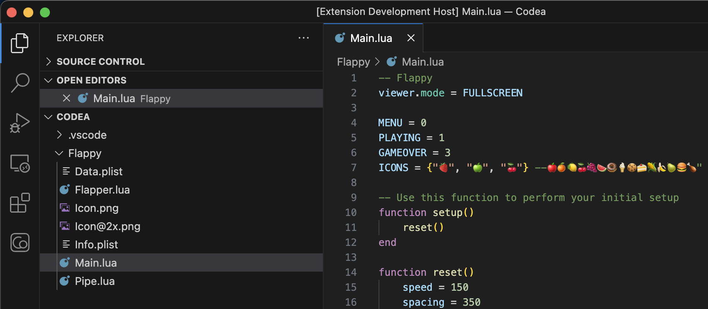

# Codea Debugger

This extension can connect remotely to the Codea iOS application, allowing to modify, tweak and debug Codea projects directly from Visual Studio Code.

## Features

### Project Editor

Once connected to Codea, Visual Studio Code will list the files for the currently opened project, allowing to modify them, even if the project is running.

### Parameters

The Codea button on the Visual Studio Code Sidebar will show the current parameters for the running project in Codea, if any.

All parameters can be controlled directly from Visual Studio Code even if the parameters are hidden in Codea, making it easier to tweak the projects.

### Lua Debugger

With a project running, Visual Studio Code can be used to attach to the running project and then used for debugging.

Some features such as conditional breakpoints or modifying variables are not available yet but will be added in future updates of Codea and the extension.

## Requirements

Codea 3.9

## Release Notes

### 1.0.0

Initial release
