# Codea Air Code

This extension can connect remotely to the [Codea](https://codea.io/) iOS application, allowing to modify, tweak and debug Codea projects directly from Visual Studio Code. Auto-completion and documentation features similar to Codea are available while working on the projects.

## Table of Contents 

- [Features](#features)
  - [Editor](#editor)
  - [Sidebar](#sidebar)
  - [Debugger](#debugger)
- [Installation](#installation)
- [Usage](#usage)
  - [Connection](#connection)
  - [USB Connection](#usb-connection)
  - [Files and Dependencies](#files-and-dependencies)
  - [Assets](#assets)
  - [Commands](#commands)
- [Requirements](#requirements)
- [License](#license)
- [Change Log](#change-log)

## Features

### Editor

Once connected to Codea, Visual Studio Code will list all the projets availables with their files and dependencies, allowing modifications even if a project is running. Assets such as images, sounds and models are also available and can easily be integrated in a project.

#### Auto-Completion

Auto-completion is available for the Codea API as well as symbols defined in the project and its dependencies.

#### Symbols

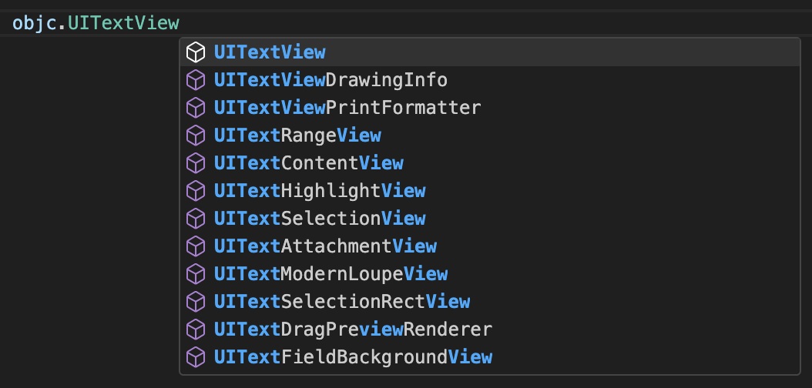

#### Colors

Methods such as `background`, `fill`, `tint`, `stroke` and `color` will show a color indicator which can be used to visualize and easily change the assigned color using VSCode's color picker.

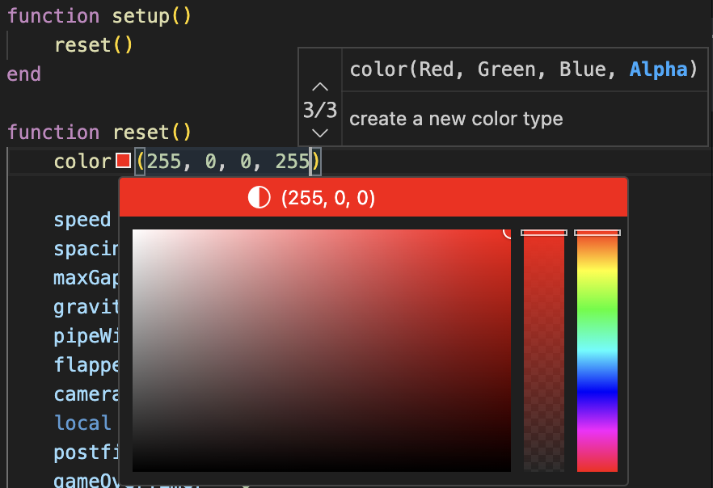

#### Font and Sprites

The `font` and `sprite` functions will automatically list the fonts and sprites available for the current project.

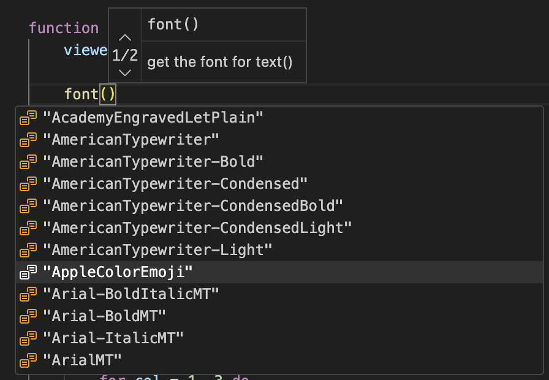

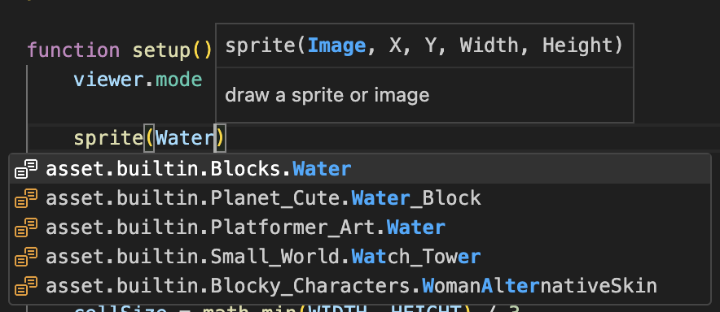

#### Snippets

Snippets make it easier to format the different Lua control structures such as `if`, `for`, `while` and `repeat`.

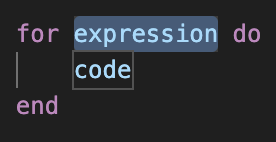

#### Documentation

Types can easily be documented using a triple-slash (`---`) comment.

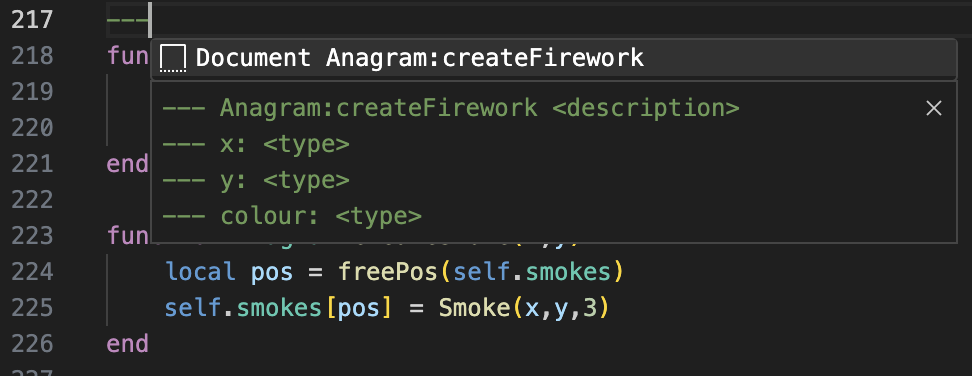

### Sidebar

The Codea Sidebar gives access to Reference and Parameters sections as shown below.

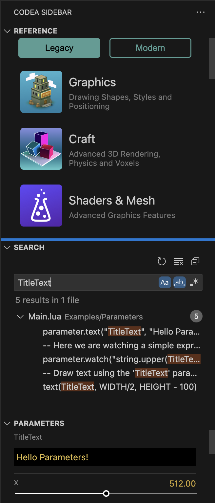

#### Reference

The Codea Reference section of the Sidebar contains the full documentation for Codea Legacy (3.x) and Modern (4.x) which can be navigated by clicking on the different chapters and functions.

It is also possible to select and right click a word in a project's code to find the corresponding reference in the Legacy documentation (or using the `Find reference...` command), automatically focusing on the sidebar and opening the corresponding page.

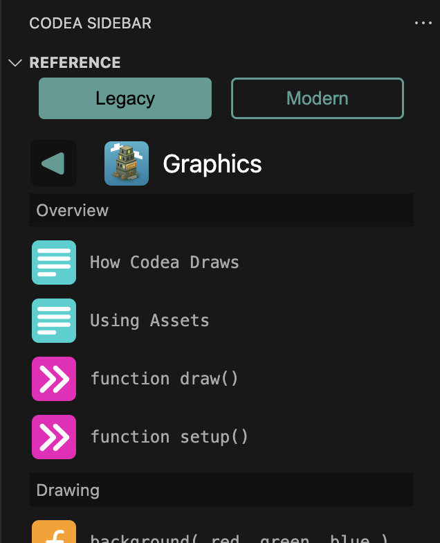

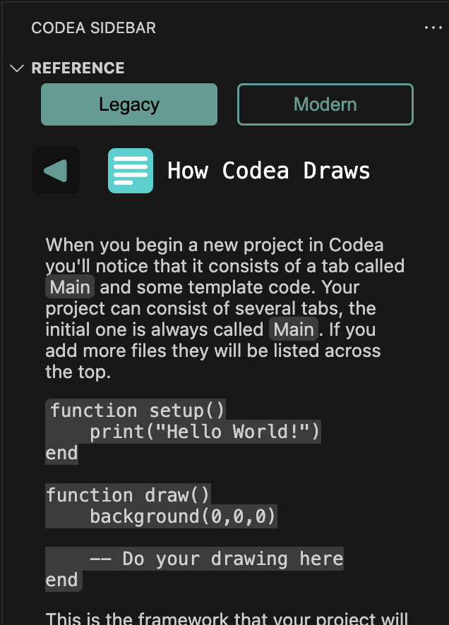

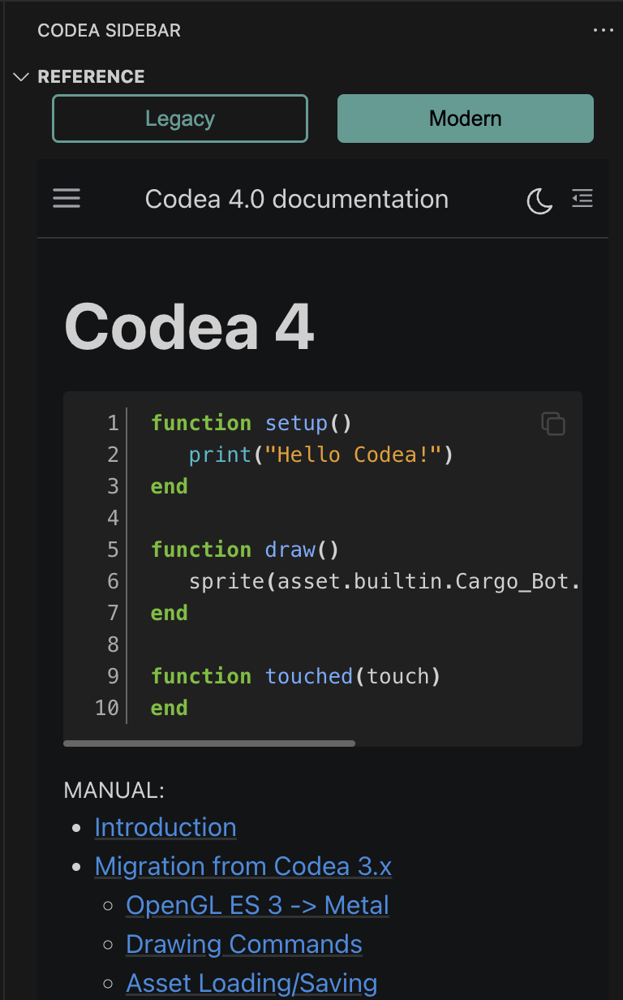

#### Search

This extension uses a virtual File System Provider to read the files from Codea. However, VSCode does not yet support searching in files provided this way (see [this issue](https://github.com/microsoft/vscode/issues/59921ùcdc2w3wwqqqq)).

Until the feature is implemented, the extension provides its own limited version which will search in all files of the currently active project.

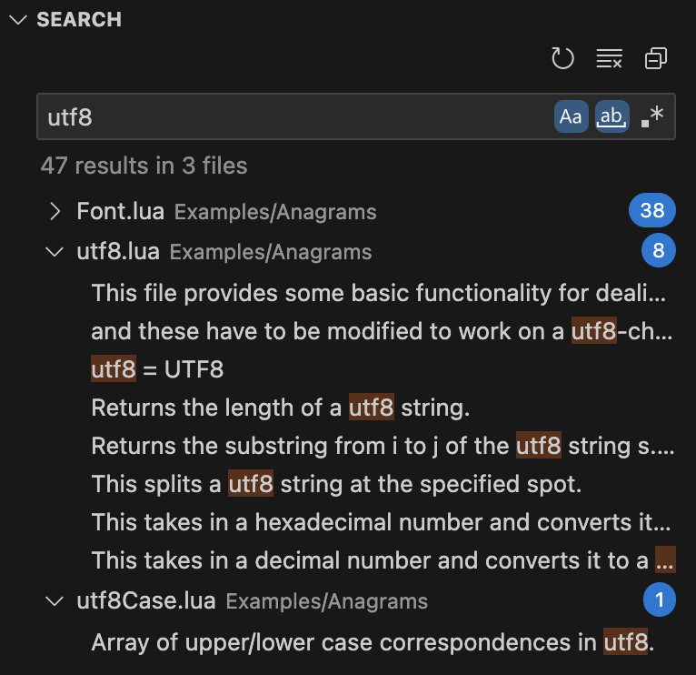

#### Parameters

The second section of the Codea Sidebar will show the current parameters for the running project, if any.

All parameters can be controlled directly from Visual Studio Code even if the parameters are hidden in Codea, making it easier to tweak the projects.

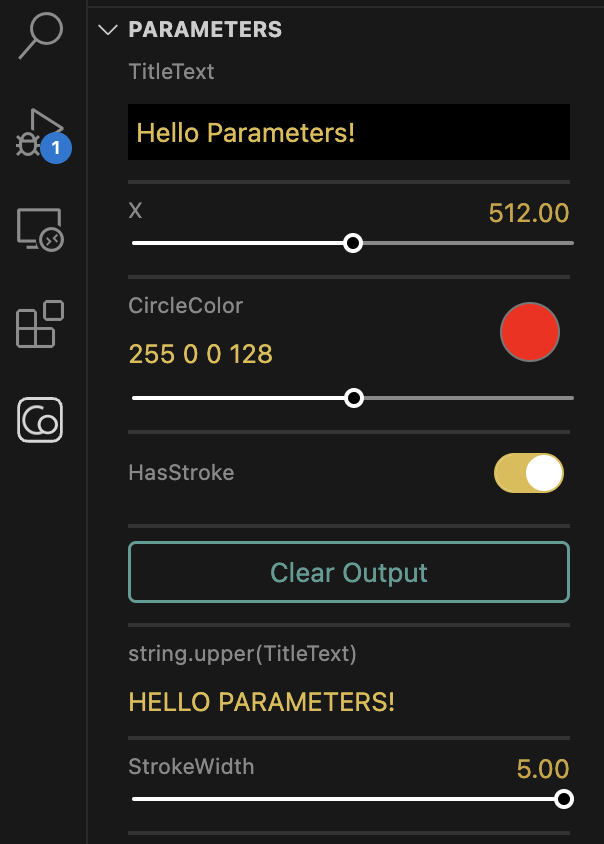

### Debugger

With a project running, Visual Studio Code can be used to attach to the running project and then used for debugging.

Values of variables and watches can be modified while the execution is paused.

#### Conditional Breakpoints

To set a condition on a breakpoint, right click a breakpoint and select `Edit Breakpoint...`:

Enter a valid Lua expression which must be `true` for the breakpoint to hit.

## Installation

Search for "Codea Air Code" in Visual Studio Code's Marketplace and install the extension.

## Usage

### Connection

After installing the extension, open the Command Palette (Ctrl+Shift+P on Windows, ⇧⌘P on Mac), and run the `Codea: Connect to Host...` command to connect to a running instance of Codea on an iOS device.

After typing Enter or clicking the command, Visual Studio Code will ask for Codea's IP:

To find the device's IP to connect to, use the Air Code icon on the project selection screen in Codea. The default port is `18513`.

#### Fun Fact

> The idea for this extension started as a proof-of-concept of a browser based "Remote Console". The idea was to see a Codea project's logs and execute commands directly from a web browser.
>
> Air Code's default port 18513 is actually based on the letters R (18) E (5) M (13), for REMote console.

### USB Connection

If Wi-Fi is not accessible or is slow, you can connect to Codea over a USB connection using iproxy, a utility part of libusbmuxd (or libimobiledevice).

For Mac and Linux platforms, libusbmuxd can be installed through Homebrew using `brew install libusbmuxd` (refer to https://brew.sh/ for Homebrew installation).

Windows executables including iproxy.exe are also available (look for `libimobiledevice windows binaries`). Make sure iTunes is installed on your Windows system and that the directory of iproxy.exe is included in your PATH environment variable.

Once iproxy is available, use the `Connect over USB...` command and provide the ports to use for the connection (local port to open on your host machine, and the port used in Codea for AirCode). If you are not using custom values, simply use the default values provided.

#### Multi-window

Air Code does not currently support multiple Codea windows or running projects. For this reason, when running a project from Air Code, all windows will be closed except one before running the project.

### Files and Dependencies

Files can be added, removed or renamed in Codea using the corresponding operations in Visual Studio Code.

Dependencies can be added to the active project (based on the current file being edited) using the `Add dependency...` command.

To remove a dependency, simply delete its corresponding folder in the Explorer.

### Assets

Assets such as images, sounds and models can be found under the Assets folder. New assets can be added by simply dragging them into a project folder, the Documents folder under Assets, or an External Folder referenced in Codea.

To reference any asset in a project, simply drag-and-drop the asset from the Explorer view **while holding the Shift key** into a Lua file and the Asset Key will automatically be added.

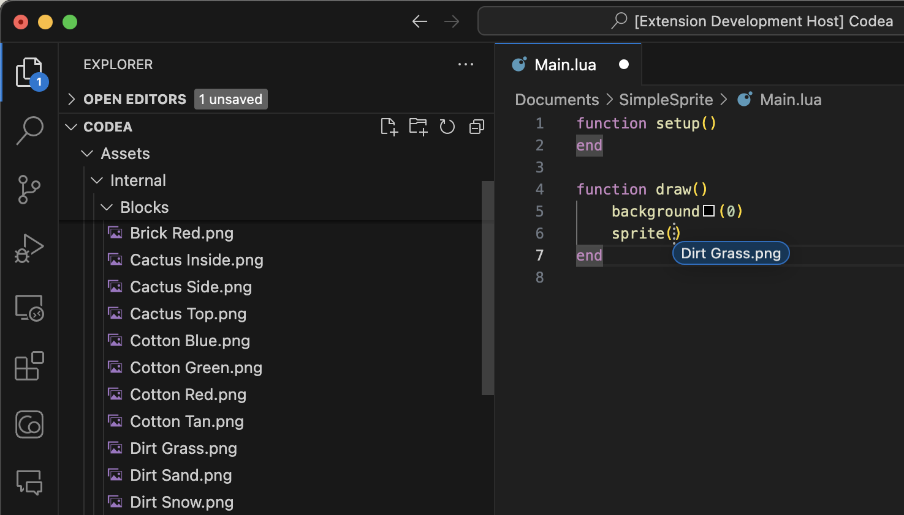

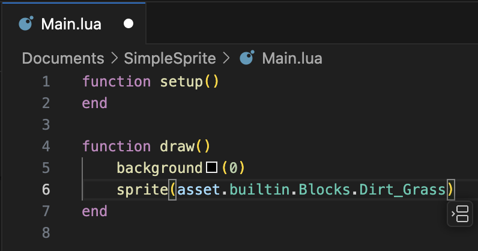

### Commands

All commands included with this extension are prefixed with `Codea:`.

| Command                | Description                                                           |
|------------------------|-----------------------------------------------------------------------|
| `Connect to Host...`   | Enter the IP and port to connect to a running instance of Codea.      |
| `Connect over USB...`  | Enter the local port and Codea port to connect over USB using iproxy. |
| `Execute current line` | Executes the Lua code on the active line.                             |
| `Execute selection`    | Executes the select Lua code in Codea.                                |
| `Execute command...`   | Enter a Lua command to execute in Codea.                              |
| `Restart project`      | Restart the running project in Codea.                                 |
| `Add dependency...`    | Select a dependency to add to the active Codea project.               |
| `Find reference...`    | Look-up the reference for the selected word.                          |

## Requirements

Codea 3.10

## License
[MIT License](LICENSE)

## Change Log
See the change log [here](CHANGELOG.md)
