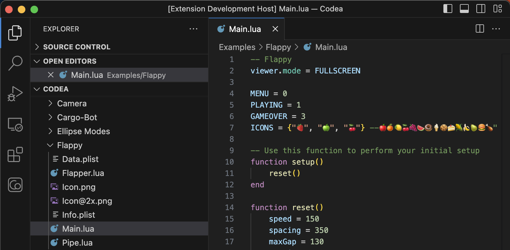

# Codea Air Code

This extension can connect remotely to the Codea iOS application, allowing to modify, tweak and debug Codea projects directly from Visual Studio Code.

## Table of Contents 

- [Features](#features)
  - [Editor](#editor)
  - [Parameters](#parameters)
  - [Debugger](#debugger)
- [Usage](#usage)
  - [Connection](#connection)
  - [Files and Dependencies](#files-and-dependencies)
  - [Commands](#commands)
- [Requirements](#requirements)
- [License](#license)
- [Change Log](#change-log)

## Features

### Editor

Once connected to Codea, Visual Studio Code will list the files for the currently opened project, allowing to modify them, even if the project is running.

### Parameters

The Codea button on the Visual Studio Code Sidebar will show the current parameters for the running project in Codea, if any.

All parameters can be controlled directly from Visual Studio Code even if the parameters are hidden in Codea, making it easier to tweak the projects.

### Debugger

With a project running, Visual Studio Code can be used to attach to the running project and then used for debugging.

Some features such as conditional breakpoints or modifying variables are not available yet but will be added in future updates of Codea and the extension.

## Usage

### Connection

After installing the extension, open the Command Palette (Ctrl+Shift+P on Windows, ⇧⌘P on Mac), and use the `Codea: Connect to Host...` command to connect to a running instance of Codea on an iOS device.

To find the device's IP to connect to, use the Air Code icon on the project selection screen in Codea.

### Files and Dependencies

Files can be added, removed or renamed in Codea using the corresponding operations in Visual Studio Code.

Dependencies can be added to the active project using the `Add dependency...` command.

To remove a dependency, simply delete its corresponding folder in the Explorer.

### Commands

All commands included with this extension are prefixed with `Codea:`.

| Command              | Description  |
|----------------------|--------------|
| Connect to Host...   | Enter the IP and port to connect to a running instance of Codea. |
| Execute current line | Executes the Lua code on the active line.                        |
| Execute selection    | Executes the select Lua code in Codea.                           |
| Execute command...   | Enter a Lua command to execute in Codea.                         |
| Restart project      | Restart the running project in Codea.                            |
| Add dependency...    | Select a dependency to add to the active Codea project.          |

## Requirements

Codea 3.9

## License
[MIT License](LICENSE)

## Change Log
See the change log [here](CHANGELOG.md)
